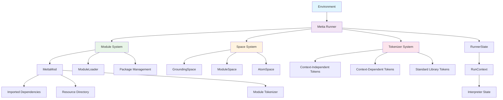
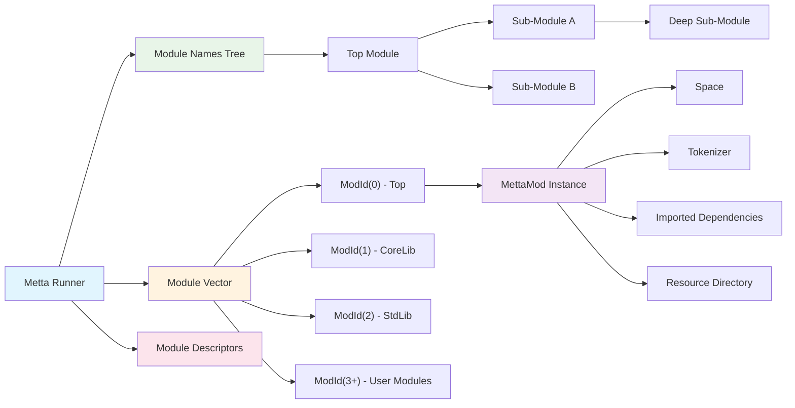
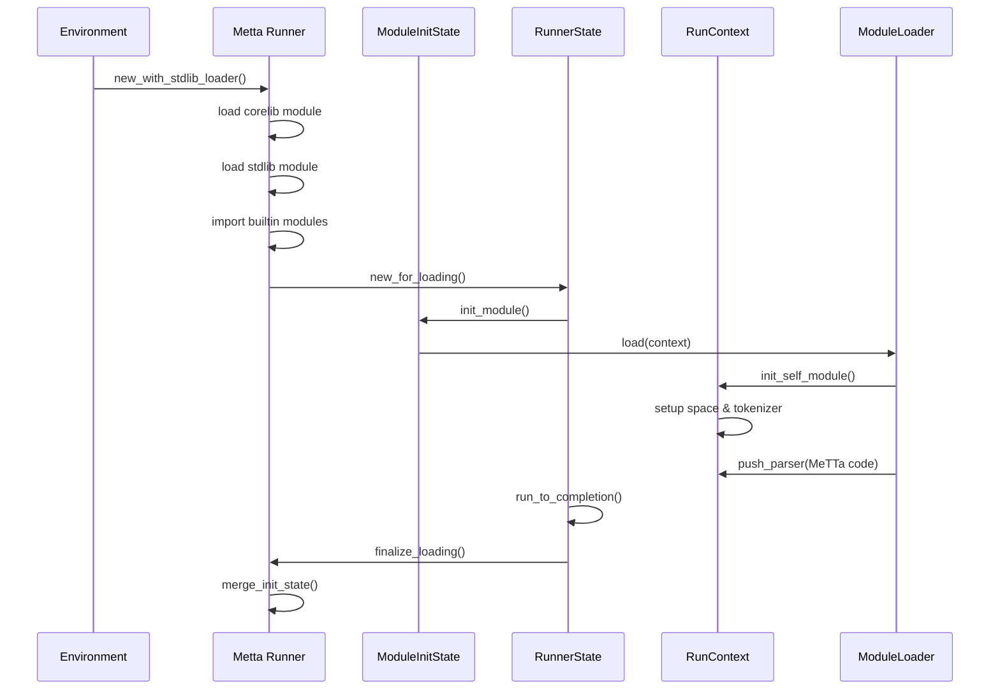
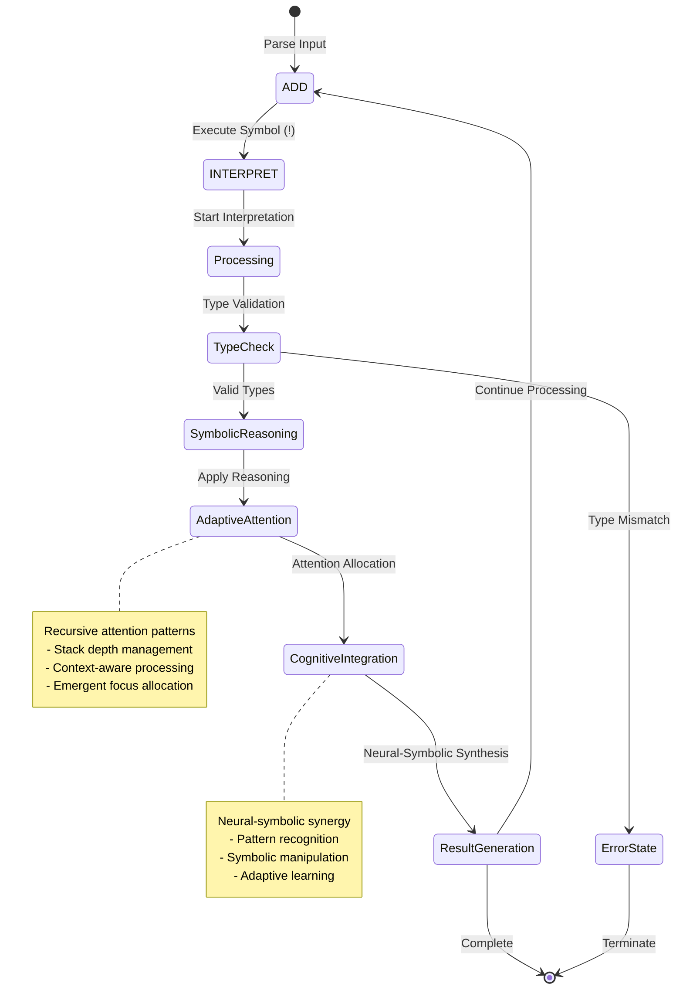
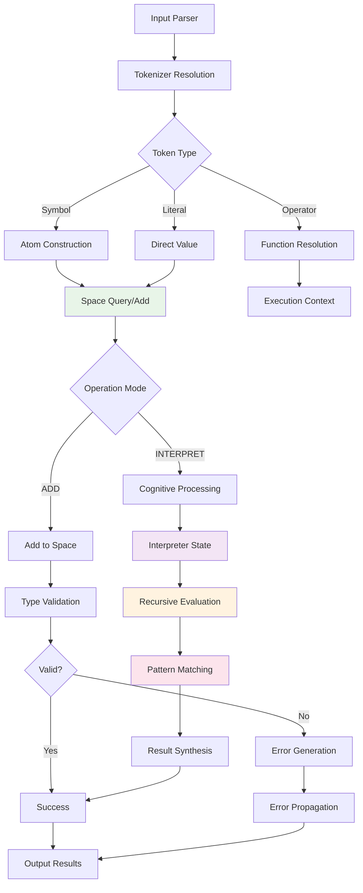
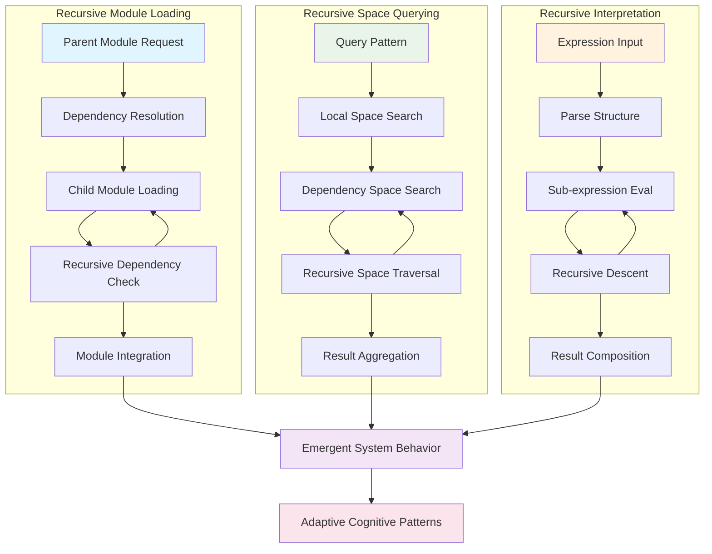
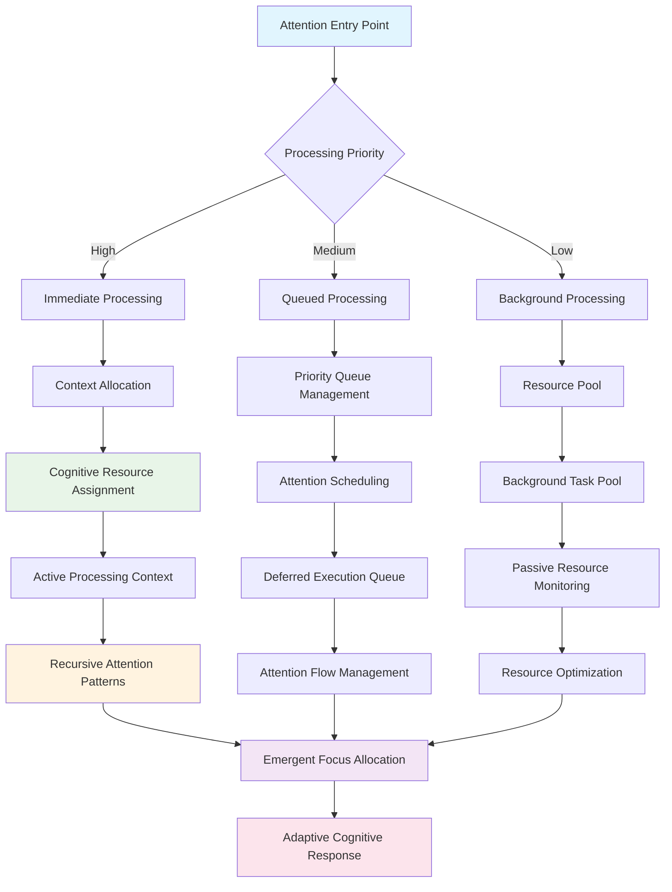
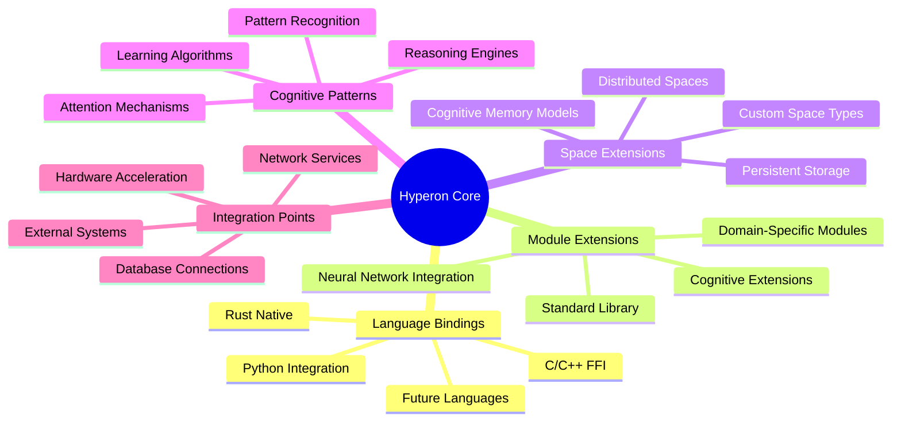

# Hyperon System Architecture

This documentation presents the architectural overview of the OpenCog Hyperon system, illustrating the recursive and emergent nature of its design patterns and the neural-symbolic integration mechanisms.

## High-Level System Overview

The Hyperon system is built around a modular, cognitive architecture that integrates symbolic reasoning with adaptive attention allocation mechanisms. The core architecture follows recursive design patterns that enable emergent cognitive behavior.

### Key Architectural Components

- **Environment**: Platform abstraction layer managing configuration, security, and external resources
- **Metta Runner**: Core execution engine hosting all state and coordinating module execution
- **Module System**: Hierarchical module management with dependency resolution and namespace isolation
- **Space System**: Multi-layered atom storage and retrieval system with cognitive space abstractions
- **Tokenizer System**: Adaptive token registration and parsing with context-aware resolution

## Module System Architecture

The module system implements a sophisticated hierarchical structure with recursive loading patterns and adaptive namespace management.

### Module Lifecycle and Initialization

## Neural-Symbolic Integration Patterns

The system implements neural-symbolic integration through adaptive attention allocation and cognitive synergy optimization mechanisms.

## Data Flow and Execution Patterns

The execution model follows recursive patterns with emergent data flows across cognitive subsystems.

## Recursive Implementation Pathways

The system exhibits recursive patterns at multiple levels, enabling emergent cognitive behavior through self-similar structures.

## Cognitive Attention Allocation Mechanisms

The system implements adaptive attention allocation through hierarchical processing and emergent focus patterns.

## System Integration and Extension Points

The architecture provides multiple extension points for cognitive enhancement and neural-symbolic integration.

This architecture documentation captures the recursive and emergent nature of the Hyperon system, providing the foundation for understanding its neural-symbolic cognitive patterns and adaptive attention allocation mechanisms.