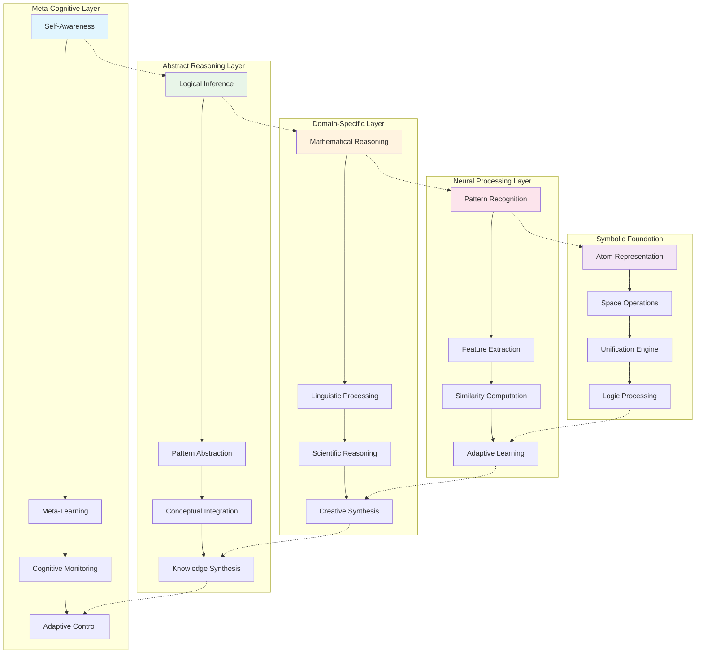
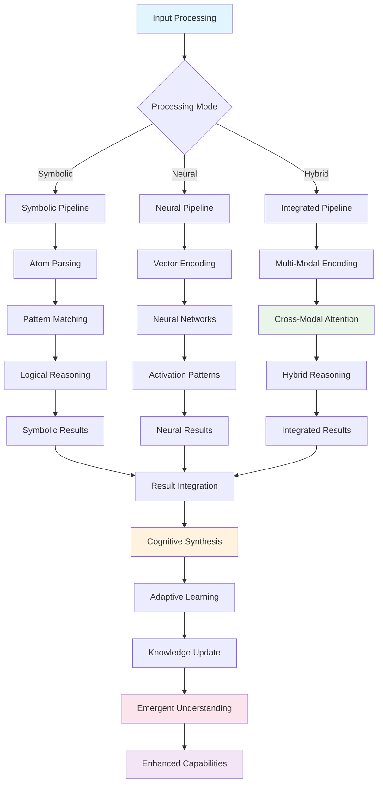
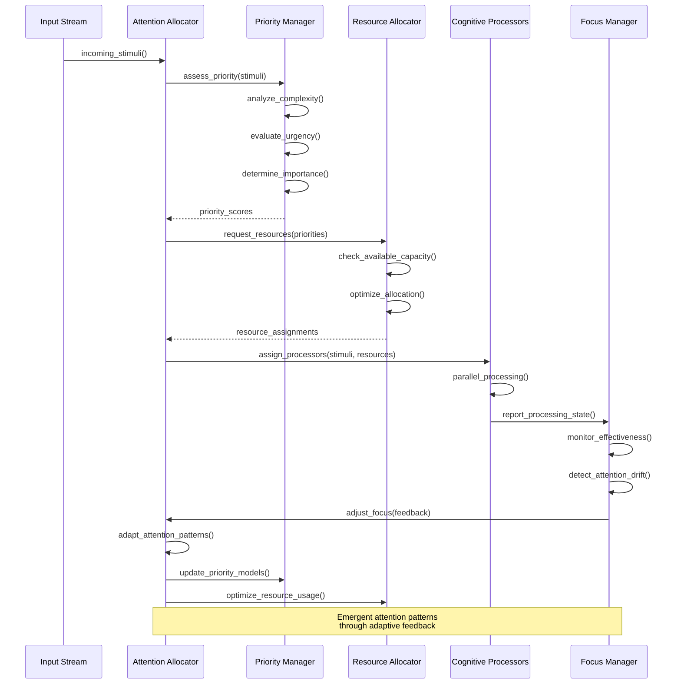
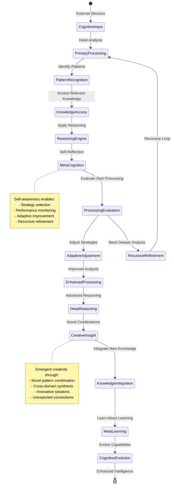
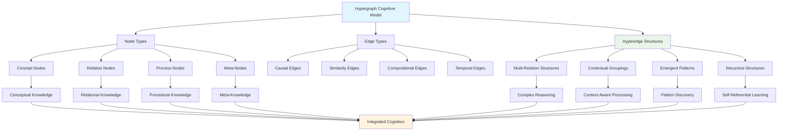
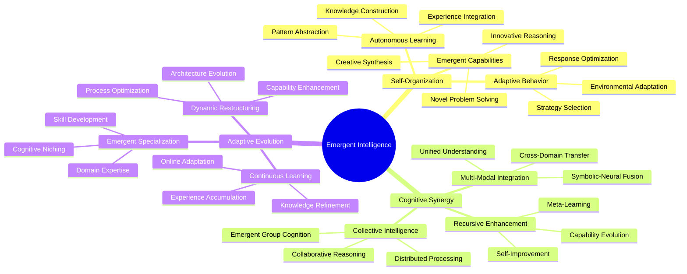
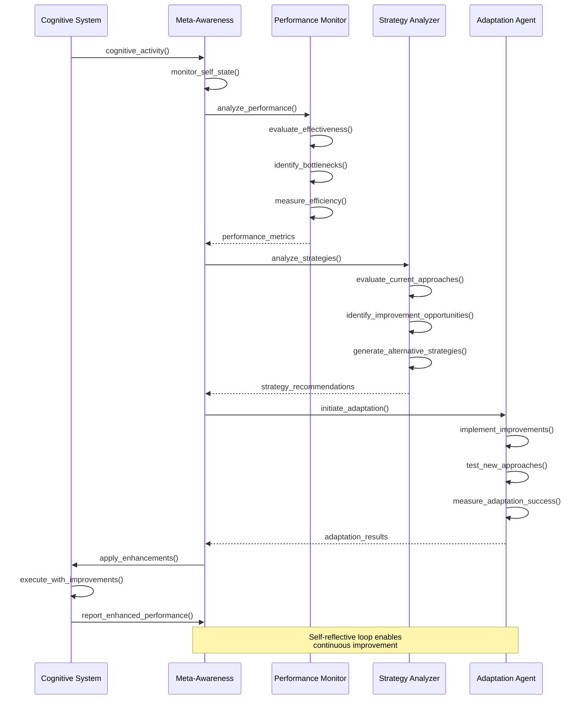
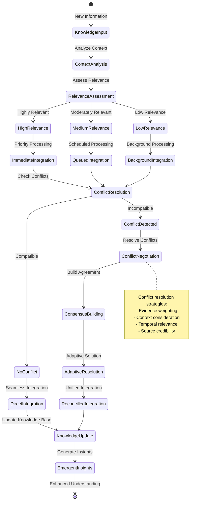

# Cognitive Patterns and Neural-Symbolic Integration

The Hyperon system implements sophisticated cognitive patterns through neural-symbolic integration, enabling emergent intelligence, adaptive learning, and recursive self-improvement capabilities.

## Cognitive Architecture Overview

The cognitive architecture implements a multi-layered approach to intelligence that integrates symbolic reasoning with neural processing through adaptive attention mechanisms.

## Neural-Symbolic Integration Mechanisms

The system implements multiple mechanisms for integrating neural and symbolic processing, enabling hybrid reasoning and emergent cognitive capabilities.

## Adaptive Attention Allocation

The system implements sophisticated attention mechanisms that enable dynamic resource allocation and emergent focus patterns.

## Recursive Cognitive Processing

The system exhibits recursive cognitive patterns that enable self-improvement and emergent intelligence through hierarchical processing layers.

## Hypergraph Pattern Encoding

The system uses hypergraph representations to encode complex cognitive patterns and enable emergent reasoning capabilities.

## Emergent Intelligence Patterns

The system exhibits emergent intelligence through the interaction of multiple cognitive subsystems and adaptive learning mechanisms.

## Cognitive Synergy Optimization

The system implements optimization mechanisms that enhance cognitive synergy and promote emergent intelligent behavior.

```mermaid
flowchart LR
    A[Cognitive Input] --> B[Multi-System Analysis]
    
    B --> C[Symbolic Processor]
    B --> D[Neural Processor]
    B --> E[Hybrid Processor]
    
    C --> F[Logical Analysis]
    D --> G[Pattern Recognition]
    E --> H[Integrated Analysis]
    
    F --> I[Symbolic Insights]
    G --> J[Neural Insights]
    H --> K[Hybrid Insights]
    
    I --> L[Synergy Evaluator]
    J --> L
    K --> L
    
    L --> M[Insight Integration]
    M --> N[Coherence Analysis]
    N --> O[Conflict Resolution]
    
    O --> P[Optimal Synthesis]
    P --> Q[Enhanced Understanding]
    Q --> R[Cognitive Enhancement]
    
    R --> S[System Adaptation]
    S --> T[Capability Evolution]
    T --> U[Emergent Intelligence]
    
    style B fill:#e1f5fe
    style L fill:#e8f5e8
    style P fill:#fff3e0
    style T fill:#fce4ec
    style U fill:#f3e5f5
```

## Meta-Cognitive Awareness and Self-Reflection

The system implements meta-cognitive capabilities that enable self-awareness, self-monitoring, and self-improvement.

## Dynamic Knowledge Integration

The system implements dynamic knowledge integration mechanisms that enable adaptive learning and emergent understanding.

This cognitive architecture enables the Hyperon system to exhibit sophisticated intelligent behavior through neural-symbolic integration, adaptive attention mechanisms, and emergent cognitive patterns that support continuous learning and self-improvement.