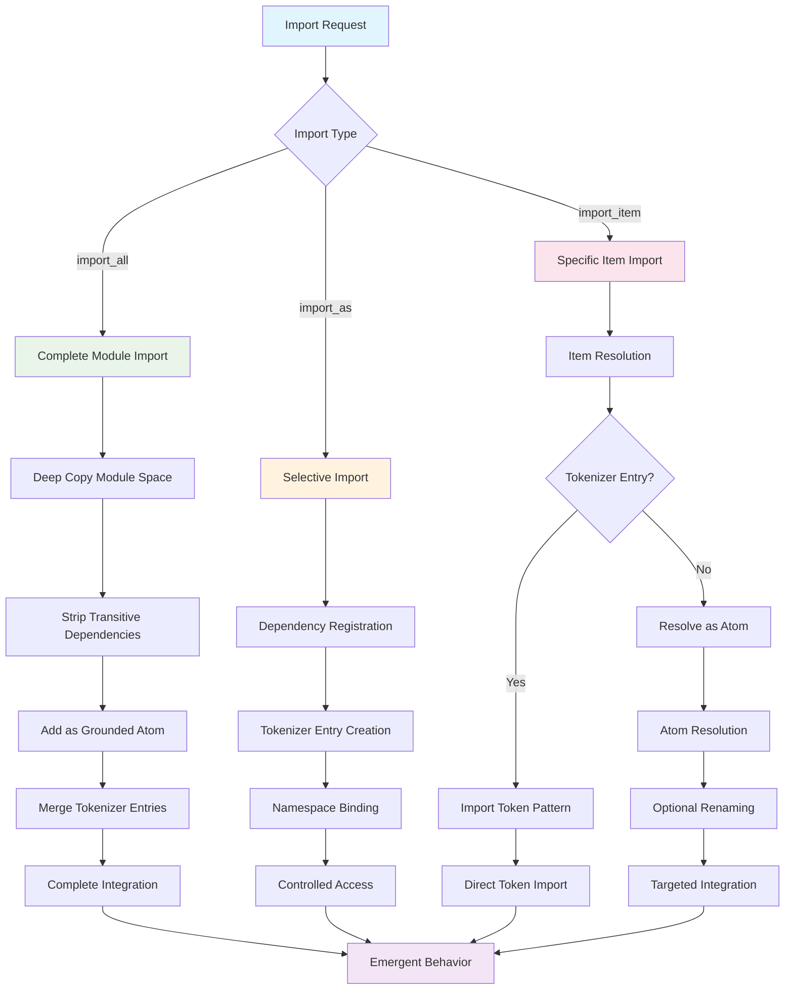

# Module System Architecture

The Hyperon module system implements a sophisticated hierarchical structure enabling recursive dependency loading, adaptive namespace management, and emergent cognitive patterns through modular composition.

## Module System Overview

## MettaMod Structure and Lifecycle

Each module encapsulates a complete cognitive unit with its own space, tokenizer, and dependency context.

## Module Loading and Initialization Flow

The module loading process follows a recursive pattern that enables complex dependency graphs and emergent module interactions.

## Recursive Dependency Resolution

The system implements sophisticated dependency resolution with support for version constraints and hierarchical module spaces.

## Module Namespace and Scoping

The module system implements hierarchical namespacing with adaptive scope resolution and emergent visibility patterns.

## Package Management Integration

The module system integrates with package management for distributed module loading and version resolution.

## Module Import Patterns and Strategies

Different import patterns enable various levels of cognitive integration and namespace management.

## Cognitive Module Interaction Patterns

Modules interact through cognitive patterns that enable emergent behavior and adaptive learning.

## Module Resource Management

Each module can provide resources that extend beyond executable code, supporting rich cognitive environments.

This module system architecture enables sophisticated cognitive applications through hierarchical organization, recursive dependency resolution, and adaptive integration patterns that support both symbolic reasoning and neural processing capabilities.