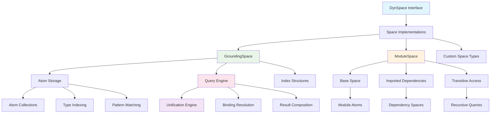
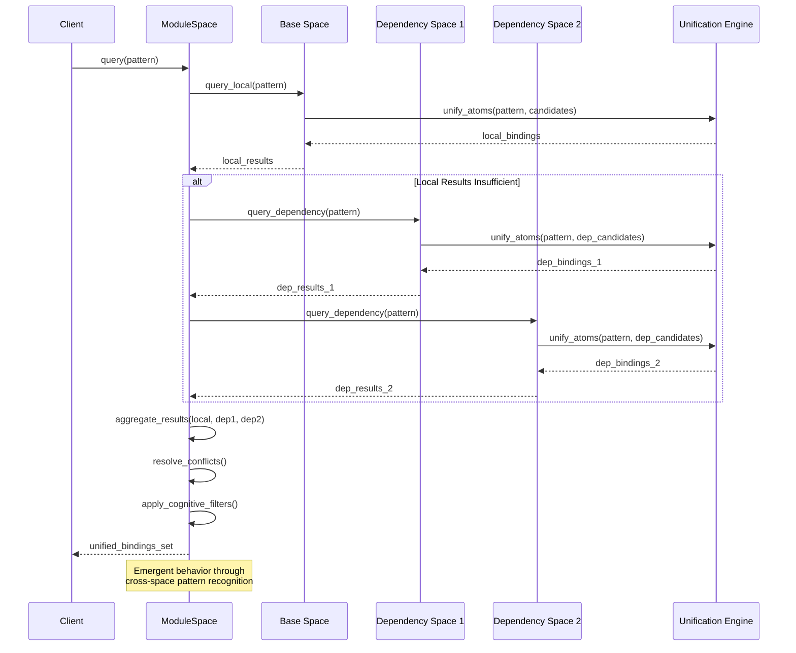
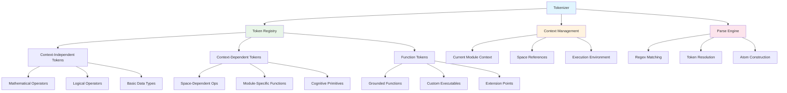
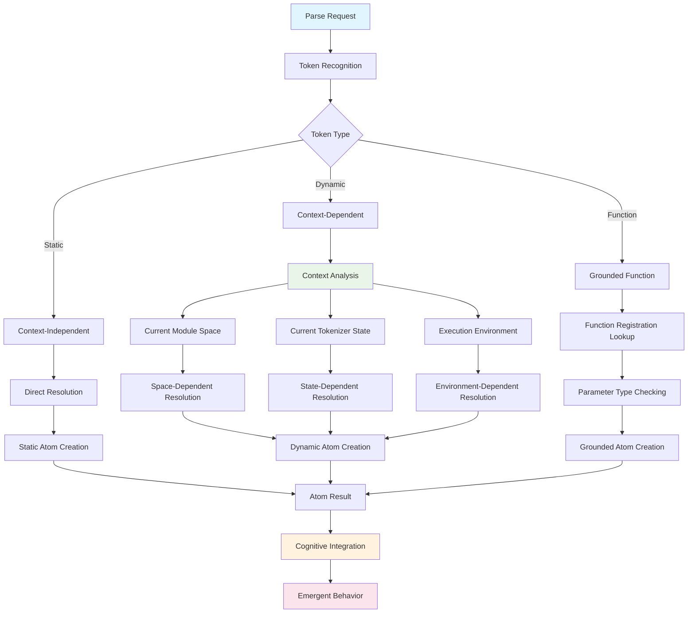
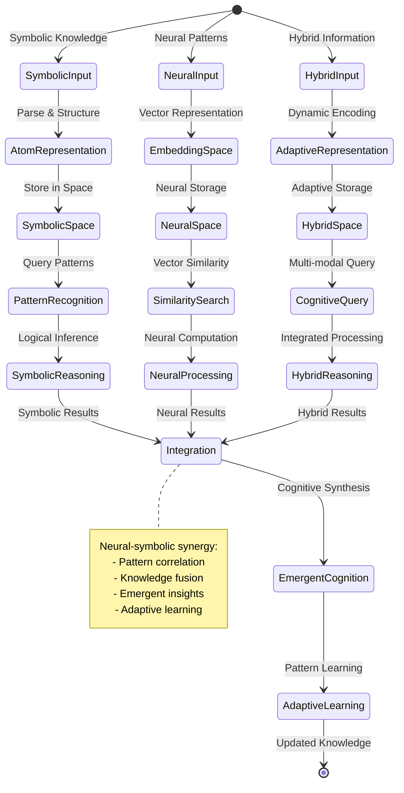
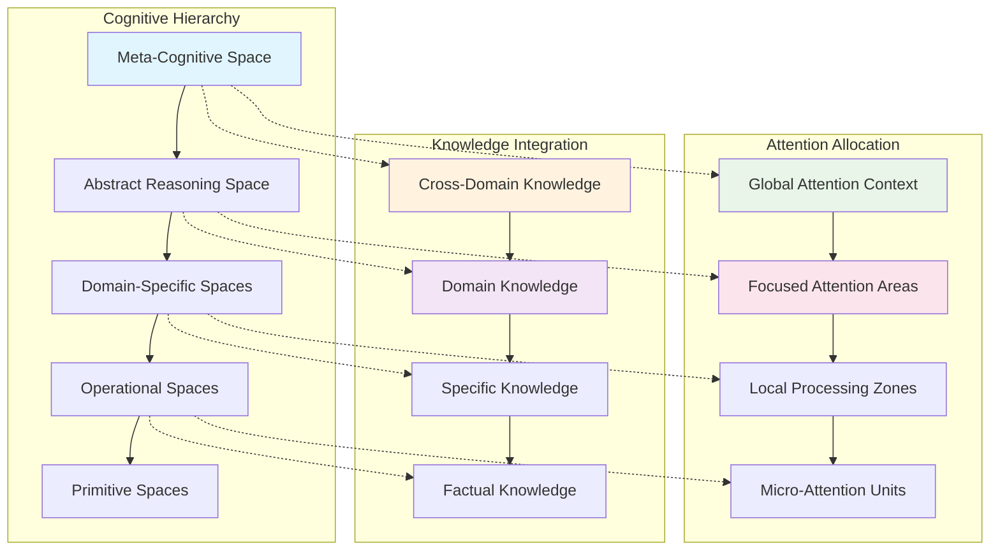
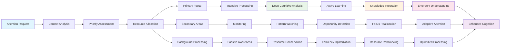
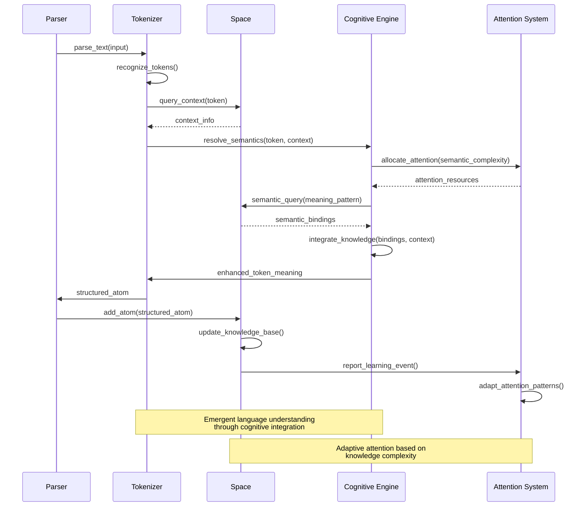
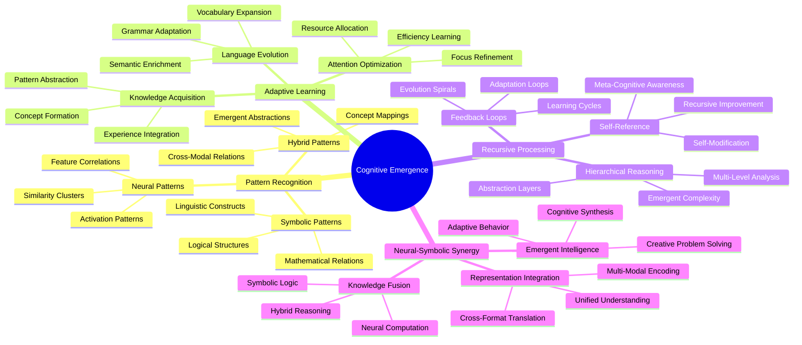

# Space and Tokenizer Architecture

The Hyperon space and tokenizer systems form the cognitive foundation for symbolic reasoning, neural-symbolic integration, and adaptive attention allocation through hierarchical knowledge representation and context-aware parsing.

## Space System Architecture

The space system implements a multi-layered architecture that enables emergent cognitive patterns through hierarchical knowledge organization and adaptive query processing.

## Space Query and Unification Patterns

The space system implements sophisticated query processing with recursive unification and emergent pattern recognition.

## Tokenizer System Architecture

The tokenizer system provides adaptive parsing and context-aware token resolution, enabling dynamic language evolution and cognitive pattern recognition.

## Context-Dependent Token Resolution

The tokenizer implements sophisticated context resolution that enables adaptive behavior and emergent cognitive patterns.

## Neural-Symbolic Integration through Spaces

The space system enables neural-symbolic integration through adaptive knowledge representation and emergent pattern recognition.

## Cognitive Space Hierarchies

The space system implements hierarchical cognitive organization that enables emergent attention allocation and adaptive reasoning patterns.

## Adaptive Attention Allocation in Spaces

The space system implements adaptive attention mechanisms that enable emergent cognitive focus and resource optimization.

## Token-Space Cognitive Integration

The integration between tokenizer and space systems enables emergent language understanding and adaptive symbolic reasoning.

## Emergent Cognitive Patterns

The space and tokenizer systems enable emergent cognitive patterns through recursive processing and adaptive learning mechanisms.

This space and tokenizer architecture provides the foundation for sophisticated cognitive computing through emergent patterns, adaptive attention allocation, and neural-symbolic integration that enables the system to exhibit intelligent behavior across multiple domains and processing modalities.